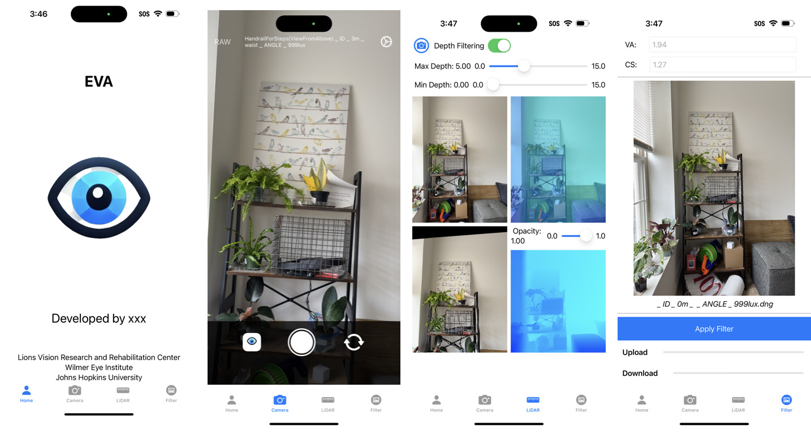

# EVA

## Developing Progress
#### iOS End
###### Camera Access
- [x] Access to Wide Angle Camera
- [x] Access to LiDAR and preview results (LiDAR, PointCloud)
- [x] Release camera stream when not using it to speed app up
- [x] Switch front and back cameras
- [x] Capture either raw or compressed image
- [x] Customize image name  

###### Data Saving
- [x] Save DNG image
- [x] Save normal image
- [x] Save filtered image
- [x] Manipulate photos within app's gallery, no need to go back to original album
- [ ] Save depth info

###### Data Transmission 
- [x] Connect to Server
- [ ] Get image from DB

###### UI
- [x] Progress bar to show image processing progress
- [x] Preview filtered image
- [x] Add Icon and use new UI structure

#### Server End
- [x] Connect to MongoDB
- [x] Receive image data then do computation using python for any image format (`.dng` also works)
- [x] change Camera's width and height based on transmitted image's size 
- [ ] Save to cloud (Now locally save to my pc)

